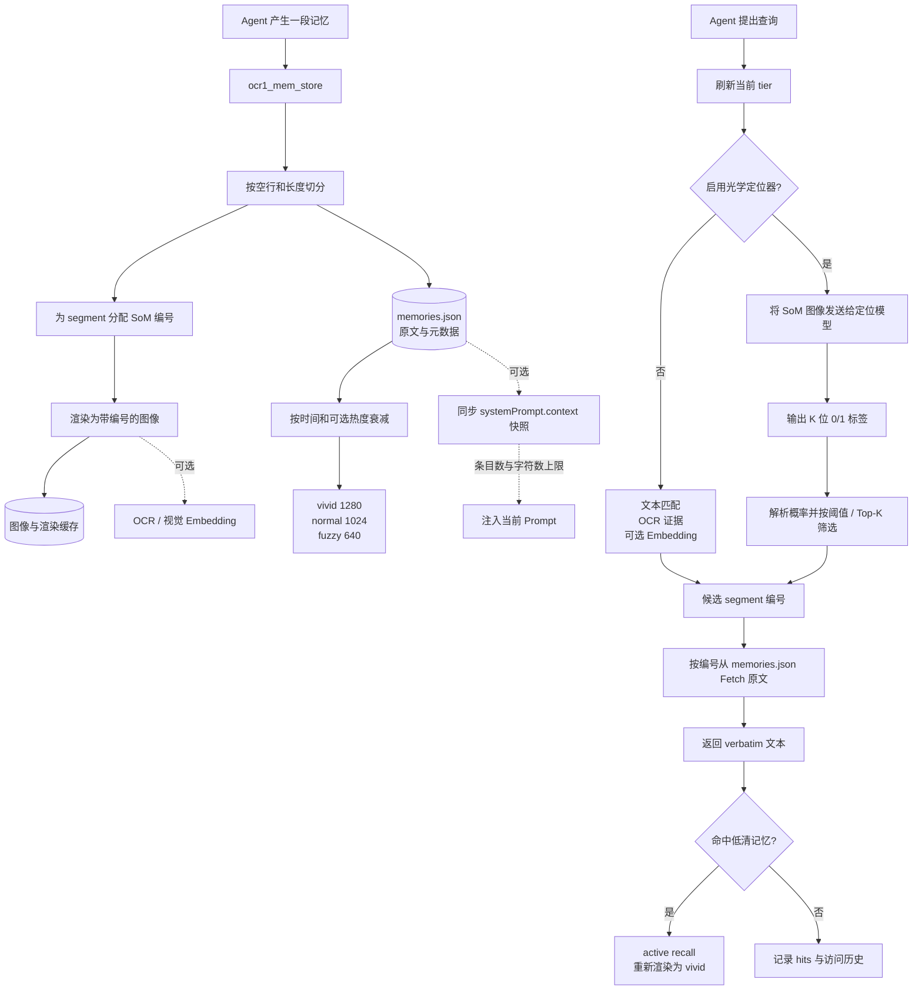

[简体中文] | [English](../docs_en/OPTICAL_MEMORY_WORKFLOW.md)

# 光学记忆插件工作流程与未实现边界

> 本文是对插件工作流程和当前复现边界的说明。

## 1. 先给结论

`@dsh-external/dsh-ocr1-memory` 的核心思路是：

```text
原始文本 → 分段并编号 → 渲染成 SoM 图像 → 按年龄降低分辨率
查询 → 查看图像并定位相关编号 → 按编号读取原文 → 原样返回
```

图像是用于压缩和定位的表示，`memories.json` 中保存的原始 segment 才是最终 Fetch 的权威来源。因此插件不会让模型重新改写记忆内容，而是尽量返回持久化的 verbatim 原文。

## 2. 总体流程图



## 3. 写入阶段

调用 `ocr1_mem_store` 后，插件会：

1. 按空行和最大长度把输入拆成多个 segment；
2. 为每个 segment 分配稳定的顺序编号；
3. 将这些 segment 渲染为带 SoM（Set of Mark）编号的方形图像；
4. 将原文、segment、tier、图像路径、命中次数等元数据保存到 store；
5. 根据配置选择性地生成 OCR 证据或视觉 embedding。

原文会保留在磁盘上。这不是把所有原文都塞进当前 Prompt，而是为了让最后一步可以按编号精确取回，避免生成式复述造成遗漏或幻觉。

## 4. 记忆老化阶段

插件默认使用三个图像 tier：

| Tier | 图像宽度 | 对应的用途 |
|---|---:|---|
| `vivid` | 1280 | 新记忆和高精度读取 |
| `normal` | 1024 | 记忆经过第一阶段老化 |
| `fuzzy` | 640 | 长期记忆、较低视觉成本 |

默认时间边界大致为：新记忆在 1 天内保持 `vivid`，之后进入 `normal`，超过 7 天进入 `fuzzy`。这些宽度参考 DeepSeek-OCR 官方的 Large、Base、Small 分辨率模式；插件的图像存储和 tier 管理属于工程实现，不等同于直接导出 DeepEncoder 内部 token。

还可以选择开启 `dynamicDecayEnabled`：

- 记录有限数量的访问时间；
- 近期且频繁命中的记忆衰减得更慢；
- 使用指数权重和倍率上限，避免“访问一次就永久高清”；
- 默认关闭，从而保持升级旧 manifest 后的兼容性。

## 5. 检索阶段

### 5.1 不启用光学定位器

插件可以使用文本 token 重叠进行候选召回，并根据配置增加：

- OCR 读回文本作为视觉证据；
- 视觉 embedding 相似度；
- 低清命中后的 active recall。

### 5.2 启用光学定位器

这是更接近 OCR-Memory 论文的路径：

1. 将每条记忆当前 tier 的 SoM 图像发送给定位模型；
2. 模型输出长度为 K 的 `0/1` 相关性序列；
3. 插件严格解析标签和概率；
4. 用阈值筛选相关 segment，没有命中时使用 Top-K 保底；
5. 根据 segment 编号，从 `memories.json` 读取原始文本；
6. 返回原始文本，不让模型重新生成答案。

这对应论文中的 **Locate-and-Transcribe**：先定位视觉区域，再转录对应的原文。[OCR-Memory 论文](https://arxiv.org/html/2604.26622v1)

### 5.3 Active recall

如果命中的是 `normal` 或 `fuzzy` 图像，插件会：

- 将该记忆重新渲染为 `vivid`；
- 记录 `hits`、`lastAccessAt` 和有限的 `accessHistory`；
- 在短暂豁免期内避免它立即再次降级。

## 6. 可选的 Prompt context

打开 `autoInjectContext` 后，插件会通过 DSH 的 `systemPrompt.context()` 注册一个动态 context：

- 同步读取本地 manifest；
- 按命中次数和最近访问时间排序；
- 受 `contextMaxEntries` 与 `contextMaxChars` 限制；
- 不执行 OCR、embedding、网络请求或异步检索；
- manifest 损坏时返回空内容，不阻断 Prompt 组装。

这条链路是“自动提供少量记忆摘要”，不是替代完整的 `ocr1_mem_retrieve`。默认关闭，因为自动注入的内容会进入模型上下文和会话记录。

## 7. 当前没有完整实现的部分

这里的“没有实现”应理解为：**当前版本没有足够证据把它交付为完整复现**，并不是这些方向理论上永远做不到。

| 项目 | 当前情况 | 为什么没有完整实现 |
|---|---|---|
| DeepEncoder 内部 tensor | 未导出每层隐藏状态和逐层视觉 token | 当前插件通过 llama.cpp/GGUF 的公开 HTTP 接口调用模型，接口返回生成结果、usage 或 embedding，不提供内部层级 hook |
| 官方内部 embedding | 已支持接口级视觉 embedding | `/v1/embeddings` 返回的向量不能直接证明等于论文内部的 DeepEncoder 表示，需要官方模型代码、处理器、pooling/projection 位置和逐项校准 |
| 论文规模训练 | 已完成小规模 LoRA 定位器闭环 | 论文级训练需要更大数据、更多计算时间、稳定的长时间推理服务，以及一致的数据和训练协议 |
| 完整基准复现 | 已有 R1–R6 和本地隔离测试 | Mind2Web、AppWorld、RULER 等长程 benchmark 需要完整数据、评测环境和论文一致的实验条件 |

## 8. 为什么这些限制与“本机”有关

### 8.1 内部 tensor 不是普通插件功能

SoM 图像的生成、文件保存、segment 定位和原文 Fetch 都可以在插件层完成；但 DeepEncoder 内部 tensor 属于模型运行时内部状态。

当前链路是：

```text
插件 → OpenAI 兼容接口 → llama.cpp / GGUF 模型
```

要拿到内部状态，需要改成直接加载模型的运行方式，并额外完成：

1. 加载兼容的模型源码和权重；
2. 找到 DeepEncoder 的 forward 路径；
3. 插入 hook 导出中间 tensor；
4. 确认每层 token 的定义和论文一致；
5. 再提供新的服务接口给插件使用。

这已经是一个新的模型后端工程，不能靠增加一个 DSH tool 就完成。

### 8.2 embedding 的问题不是单纯的显卡问题

本机已经能够运行接口级的视觉 embedding，也能够进行部分 LoRA 实验。因此限制并不是“AMD 显卡绝对不能做”。真正的问题是：当前后端没有公开官方内部表示，也没有足够证据证明接口返回的 pooled embedding 与论文内部 embedding 完全一致。

如果要继续推进，需要使用可插入模型 hook 的 Transformers/原生推理链，并对官方实现和当前后端输出做一致性校准。

### 8.3 论文规模是资源和协议问题

本机的小规模训练已经证明：

```text
SoM 数据 → 图像输入 → 二元监督 → LoRA → 严格解码 → 定位评估
```

这条闭环可以工作。但小规模闭环不等于论文主表。继续扩大规模还需要：

- 论文所用数据和完整划分；
- 更大的训练和评估预算；
- Mind2Web、AppWorld、RULER 等基准的完整运行条件；
- 对模型版本、量化、提示词、标签语法和评测脚本的严格对齐。

因此当前最诚实的交付表述是：插件实现了 OCR1/OCR-Memory 的主要工程机制，但没有宣称复现 DeepEncoder 内部实现或论文规模实验结果。

## 9. 参考资料

- [DeepSeek-OCR 官方仓库](https://github.com/deepseek-ai/DeepSeek-OCR)
- [DeepSeek-OCR 官方 README](https://github.com/deepseek-ai/DeepSeek-OCR/blob/main/README.md)
- [DeepSeek-OCR 论文](https://arxiv.org/abs/2510.18234)
- [OCR-Memory 论文](https://arxiv.org/abs/2604.26622)
- [llama.cpp Server 文档](https://github.com/ggml-org/llama.cpp/blob/master/tools/server/README.md)
