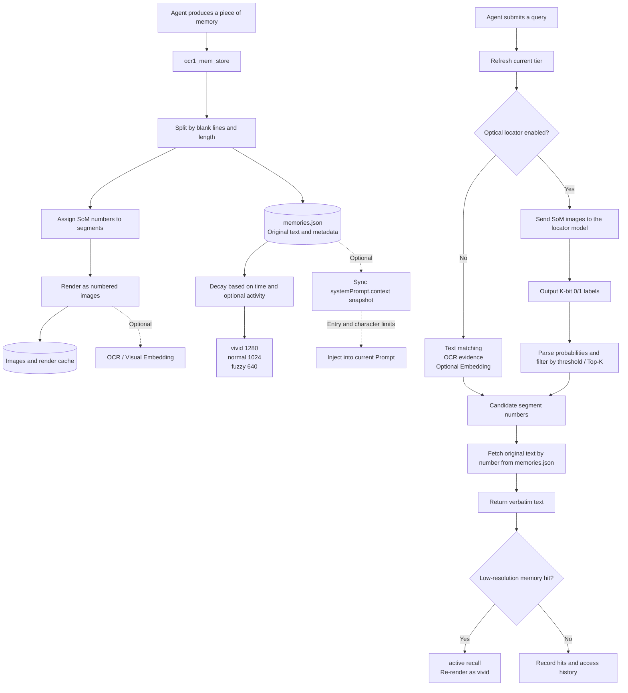

[Chinese](../docs/OPTICAL_MEMORY_WORKFLOW.md) | English

# Optical Memory Plugin Workflow and Unimplemented Boundaries

> This document explains the plugin workflow and the current boundaries of the reproduction.

## 1. Conclusion First

The core idea of `@dsh-external/dsh-ocr1-memory` is:

```text
Raw text → segment and number → render as SoM images → reduce resolution based on age
Query → inspect images and locate relevant numbers → read the original text by number → return it verbatim
```

Images are representations used for compression and localization, while the original segments stored in `memories.json` are the authoritative source for the final Fetch. Therefore, the plugin does not have the model rewrite memory content; instead, it returns the persisted verbatim original text whenever possible.

## 2. Overall Workflow Diagram



## 3. Write Stage

After `ocr1_mem_store` is called, the plugin:

1. Splits the input into multiple segments based on blank lines and the maximum length;
2. Assigns a stable sequential number to each segment;
3. Renders these segments as square images with SoM (Set of Mark) numbers;
4. Saves metadata such as the original text, segments, tier, image paths, and hit counts to the store;
5. Optionally generates OCR evidence or visual embeddings according to the configuration.

The original text remains on disk. This does not mean placing all original text into the current Prompt; rather, it allows the final step to retrieve the text precisely by number, avoiding omissions or hallucinations caused by generative paraphrasing.

## 4. Memory Aging Stage

The plugin uses three image tiers by default:

| Tier | Image Width | Intended Use |
|---|---:|---|
| `vivid` | 1280 | New memories and high-precision reading |
| `normal` | 1024 | Memories after the first aging stage |
| `fuzzy` | 640 | Long-term memory with lower visual cost |

The default time boundaries are approximately as follows: new memories remain `vivid` for 1 day, then enter `normal`, and enter `fuzzy` after 7 days. These widths reference the official DeepSeek-OCR Large, Base, and Small resolution modes; the plugin's image storage and tier management are engineering implementations and are not equivalent to directly exporting the DeepEncoder's internal tokens.

`dynamicDecayEnabled` can also be enabled optionally:

- Record a limited number of access timestamps;
- Memories accessed recently and frequently decay more slowly;
- Use exponential weights and a multiplier cap to avoid making a memory “permanently high-resolution after a single access”;
- Keep it disabled by default to preserve compatibility after upgrading an old manifest.

## 5. Retrieval Stage

### 5.1 Without the Optical Locator Enabled

The plugin can use text token overlap for candidate recall and, depending on the configuration, add:

- Text read back by OCR as visual evidence;
- Visual embedding similarity;
- active recall after a low-resolution hit.

### 5.2 With the Optical Locator Enabled

This path is closer to the OCR-Memory paper:

1. Send the SoM image at the current tier for each memory to the locator model;
2. The model outputs a `0/1` relevance sequence of length K;
3. The plugin strictly parses the labels and probabilities;
4. Filter relevant segments using a threshold, with Top-K as a fallback when there are no hits;
5. Read the original text from `memories.json` according to the segment number;
6. Return the original text without having the model regenerate the answer.

This corresponds to **Locate-and-Transcribe** in the paper: first locate the visual region, then transcribe the corresponding original text. [OCR-Memory paper](https://arxiv.org/html/2604.26622v1)

### 5.3 Active recall

If the hit is a `normal` or `fuzzy` image, the plugin:

- Re-renders that memory as `vivid`;
- Records `hits`, `lastAccessAt`, and a limited `accessHistory`;
- Prevents it from being downgraded again immediately during a brief grace period.

## 6. Optional Prompt Context

After `autoInjectContext` is enabled, the plugin registers a dynamic context through DSH's `systemPrompt.context()`:

- Synchronously reads the local manifest;
- Sorts by hit count and most recent access time;
- Is limited by `contextMaxEntries` and `contextMaxChars`;
- Does not perform OCR, embedding, network requests, or asynchronous retrieval;
- Returns empty content when the manifest is corrupted, without blocking Prompt assembly.

This path “automatically provides a small number of memory summaries”; it does not replace the complete `ocr1_mem_retrieve`. The default `contextMode: index` injects only L1/optical metadata (never bodies); `contextMode: snapshot` uses this full-body summary path, which consumes more model context and session records and must be enabled explicitly.

## 7. Parts Not Fully Implemented at Present

Here, “not implemented” should be understood as: **the current version does not have sufficient evidence to deliver it as a complete reproduction**. It does not mean that these directions are theoretically impossible forever.

| Item | Current Status | Why It Is Not Fully Implemented |
|---|---|---|
| DeepEncoder internal tensor | Per-layer hidden states and per-layer visual tokens are not exported | The current plugin invokes the model through llama.cpp/GGUF's public HTTP interface, which returns generation results, usage, or embeddings but does not provide internal layer hooks |
| Official internal embedding | Interface-level visual embeddings are supported | Vectors returned by `/v1/embeddings` cannot directly prove that they are equivalent to the DeepEncoder representations inside the paper; this requires the official model code, processor, pooling/projection locations, and item-by-item calibration |
| Paper-scale training | A small-scale LoRA locator closed loop has been completed | Paper-scale training requires more data, more compute time, a stable long-running inference service, and consistent data and training protocols |
| Complete benchmark reproduction | R1–R6 and local isolated tests are available | Long-horizon benchmarks such as Mind2Web, AppWorld, and RULER require complete data, evaluation environments, and experimental conditions consistent with the paper |

## 8. Why These Limitations Are Related to the Local Machine

### 8.1 Internal Tensors Are Not an Ordinary Plugin Feature

SoM image generation, file storage, segment localization, and original-text Fetch can all be completed at the plugin layer; however, the DeepEncoder's internal tensors belong to the model runtime's internal state.

The current path is:

```text
Plugin → OpenAI-compatible interface → llama.cpp / GGUF model
```

Obtaining internal states requires switching to an execution method that loads the model directly and additionally completing the following:

1. Load compatible model source code and weights;
2. Locate the DeepEncoder forward path;
3. Insert hooks to export intermediate tensors;
4. Confirm that the definition of tokens at each layer is consistent with the paper;
5. Then provide a new service interface for the plugin to use.

This is already a new model backend engineering project and cannot be completed merely by adding a DSH tool.

### 8.2 The Embedding Issue Is Not Simply a GPU Issue

The local machine can already run interface-level visual embeddings and can also conduct some LoRA experiments. Therefore, the limitation is not that “AMD GPUs absolutely cannot do this.” The actual issue is that the current backend does not expose the official internal representations, and there is insufficient evidence to prove that the pooled embeddings returned by the interface are fully consistent with the internal embeddings in the paper.

Further progress would require a Transformers/native inference path that allows model hooks, together with consistency calibration between the official implementation and the current backend's output.

### 8.3 Paper Scale Is a Resource and Protocol Issue

Small-scale training on the local machine has already demonstrated that:

```text
SoM data → image input → binary supervision → LoRA → strict decoding → localization evaluation
```

This closed loop can work. However, a small-scale closed loop is not equivalent to the paper's main table. Further scaling also requires:

- The data used in the paper and its complete splits;
- A larger training and evaluation budget;
- Complete runtime conditions for benchmarks such as Mind2Web, AppWorld, and RULER;
- Strict alignment of model versions, quantization, prompts, label syntax, and evaluation scripts.

Therefore, the most honest current delivery statement is: the plugin implements the primary engineering mechanisms of OCR1/OCR-Memory, but does not claim to reproduce the DeepEncoder's internal implementation or the paper-scale experimental results.

## 9. References

- [Official DeepSeek-OCR repository](https://github.com/deepseek-ai/DeepSeek-OCR)
- [Official DeepSeek-OCR README](https://github.com/deepseek-ai/DeepSeek-OCR/blob/main/README.md)
- [DeepSeek-OCR paper](https://arxiv.org/abs/2510.18234)
- [OCR-Memory paper](https://arxiv.org/abs/2604.26622)
- [llama.cpp Server documentation](https://github.com/ggml-org/llama.cpp/blob/master/tools/server/README.md)
